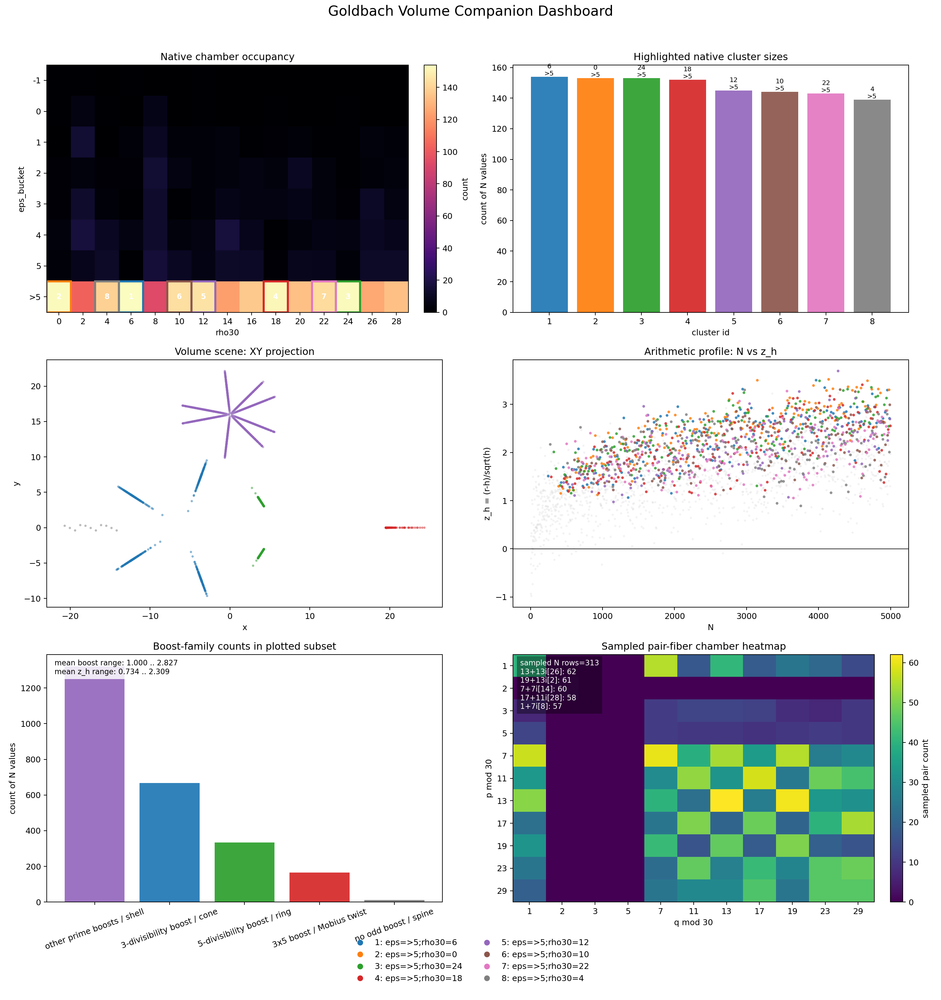
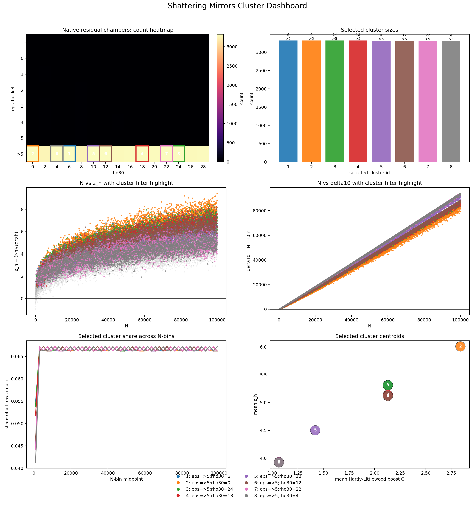
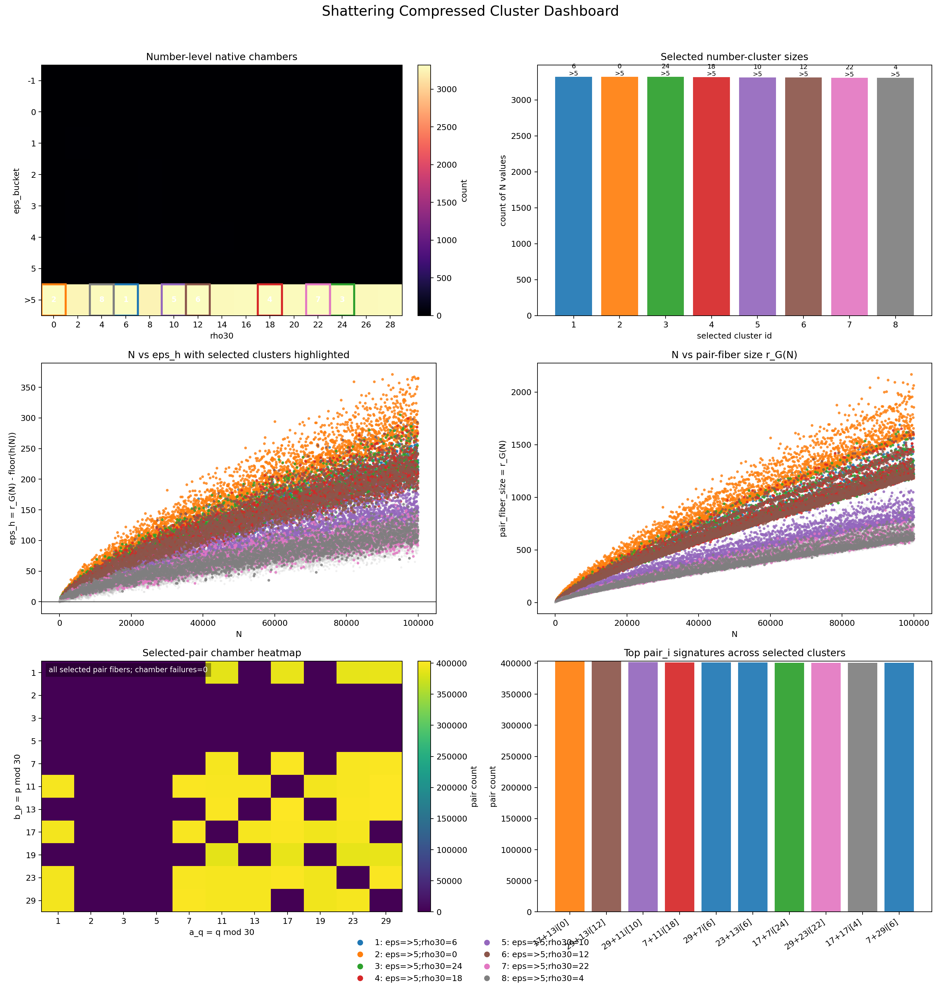

# Goldbach-Collatz Research Workspace

**AI enhanced repo by ChatGPT**

This repository organizes exploratory, computation-first experiments around:

- Goldbach pair counting and residual clustering.
- Compressed residue-family views of Goldbach pair fibers.
- Collatz-relation context (classical `3m+1` and experimental `5m+1` framing).

## Important Mathematical Status 

- The **Goldbach conjecture** is still open. This repository does **not** provide a proof.
- The scripts compute exact Goldbach pair counts for tested ranges and compare them to heuristic expectations.
- For Collatz-style dynamics, this repo currently provides conceptual framing only; it does not claim proofs for `3m+1` or `5m+1` dynamics.

## Repository Layout

```text
.
├── scripts/
│   ├── goldbach_native_filter.py
│   ├── goldbach_volume.py
│   ├── shattering_compressed.py
│   └── shattering_mirrors.py
├── outputs/
│   ├── csv/
│   ├── html/
│   └── plots/
├── README.md
└── RESULTS.md
```

## Goldbach Model Used in Scripts

The main pipeline combines:

1. Exact Goldbach counts:
   - For each even `N`, count unordered prime pairs `(p, q)` with `p + q = N`.
2. Heuristic expectation:
   - A Hardy-Littlewood-style estimate `h(N)` with local odd-prime boost factors.
3. Residual chambers:
   - `eps_h = r_G(N) - floor(h(N))`
   - `rho30 = N mod 30`
   - Cluster labels such as `eps=>5;rho30=6`
4. Pair-fiber compression:
   - Residue signatures over `q mod 30` and `p mod 30`.

These are diagnostics and structural summaries, not proofs.

## Collatz Relations: 3m+1 and 5m+1

This project name references Collatz-style maps. To be explicit:

- Classical Collatz odd-step relation: `n -> 3n + 1` (often paraphrased as `3m+1`).
- Experimental variant relation: `n -> 5n + 1` (paraphrased as `5m+1`).

In this repository version:

- These relations are treated as conceptual context for integer-dynamics exploration.
- The current checked-in scripts and outputs are primarily Goldbach-focused.
- No theorem-level claim is made for convergence, divergence, or cycle classification in either `3m+1` or `5m+1`.

## How To Run

From repository root:

```bash
python scripts/shattering_mirrors.py --max-n 100000 --plot --plot-prefix outputs/plots/shattering_mirrors_100k
python scripts/shattering_compressed.py --max-n 100000 --plot --plot-prefix outputs/plots/shattering_compressed_100k
```

To place generated tabular outputs in the organized folders, pass output paths explicitly, for example:

```bash
python scripts/shattering_mirrors.py \
  --max-n 100000 \
  --out outputs/csv/goldbach_h_clusters.csv \
  --summary-out outputs/csv/goldbach_h_cluster_summary.csv \
  --mirror-out outputs/csv/goldbach_decimal_mirror_hits.csv \
  --plot \
  --plot-prefix outputs/plots/shattering_mirrors_100k
```

## Visual Results

### Interactive HTML graphics

- [Goldbach Volume 5k](outputs/html/goldbach_volume_5k.html)
- [Goldbach Volume 5k mod30](outputs/html/goldbach_volume_5k_mod30.html)
- [Goldbach Volume 5k v2](outputs/html/goldbach_volume_5k_v2.html)
- [Goldbach Volume 10k mod210](outputs/html/goldbach_volume_10k_mod210.html)

### Preview graphics (linked to artifacts)

[](outputs/html/goldbach_volume_5k_v2.html)





## Results Summary

For concrete dataset counts and observed patterns, see:

- [RESULTS.md](RESULTS.md)
