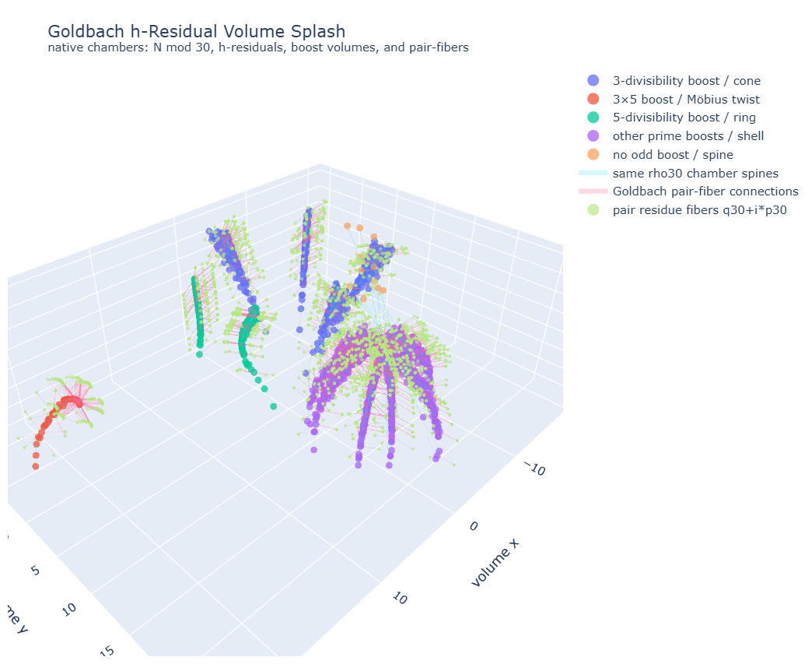
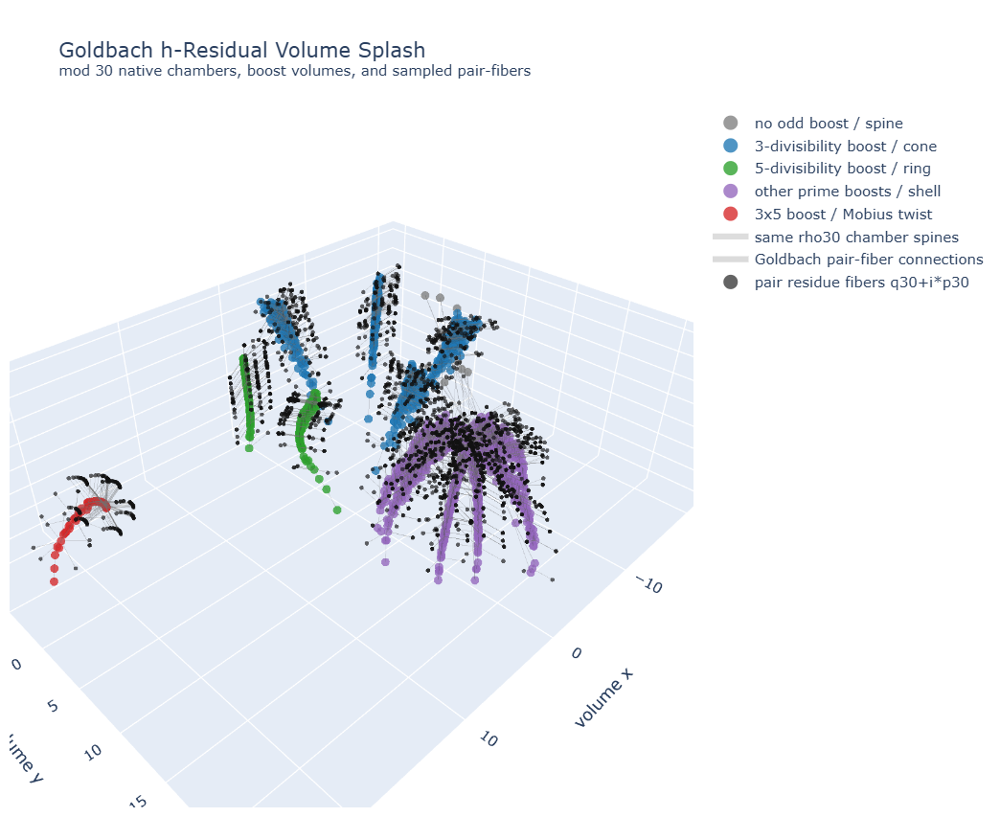
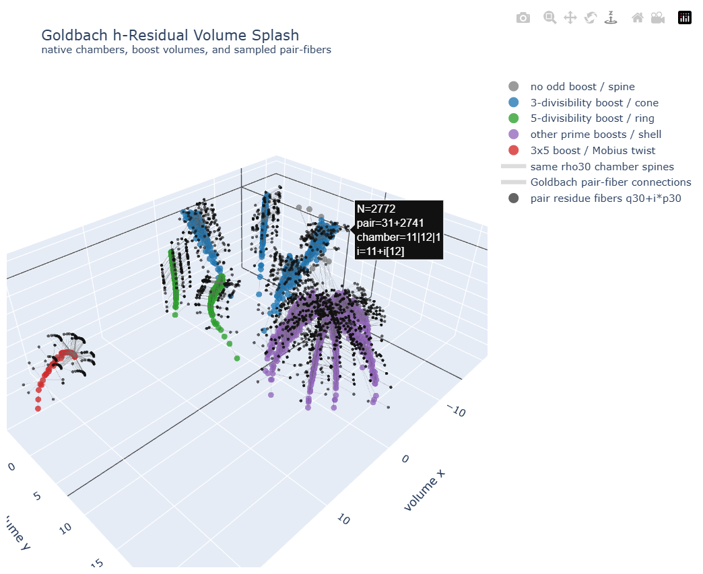
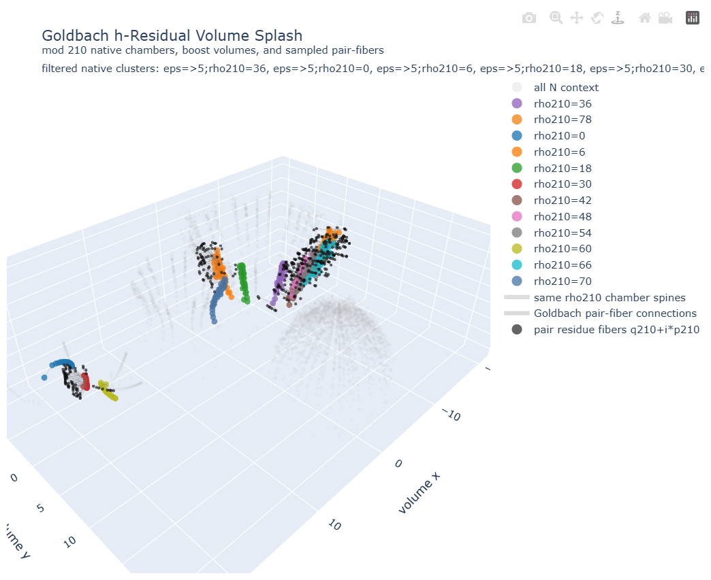

# Goldbach-Collatz Research Workspace

This repository is an exploratory Goldbach diagnostics workspace with Collatz kept as context only.

## Mathematical status

- The Goldbach conjecture is still open.
- Nothing here is a proof.
- The scripts compute exact Goldbach counts on finite ranges and compare them to heuristic expectations.
- The checked-in Collatz references are framing only. The current code and outputs are overwhelmingly Goldbach-centric.

## What changed

The previous clustering path used raw `eps_h = r_G(N) - floor(h(N))`, which drifts with `N`. The main clustering path now keeps `eps_h` only as a recorded diagnostic and instead uses:

- a single global calibration of `h(N)` over the run
- `z_h = (r - alpha*h) / sqrt(alpha*h)`
- fixed-step `z_h` labels stored in `z_bucket`, paired with `rho30 = N mod 30`

That keeps the residual summaries comparable across the range and avoids reading scale drift in `eps_h` as structure.

## Repository layout

```text
.
├── scripts/
│   ├── goldbach_native_filter.py
│   ├── goldbach_volume.py
│   ├── shattering_compressed.py
│   └── shattering_mirrors.py
├── tests/
├── outputs/
│   ├── csv/
│   ├── html/
│   └── plots/
├── .github/workflows/ci.yml
├── DATA_DICTIONARY.md
├── README.md
├── RESULTS.md
├── next_steps.md
└── requirements.txt
```

## Environment

```bash
python -m venv .venv
source .venv/bin/activate
pip install -r requirements.txt
```

## Run

The main scripts now default to the organized output folders.

```bash
python scripts/shattering_mirrors.py --max-n 100000 --plot --plot-prefix outputs/plots/shattering_mirrors_100k
python scripts/shattering_compressed.py \
  --max-n 100000 \
  --plot \
  --plot-prefix outputs/plots/shattering_compressed_100k \
  --numbers-out outputs/csv/shattering_compressed_100k_numbers.csv \
  --summary-out outputs/csv/shattering_compressed_100k_cluster_summary.csv \
  --signatures-out outputs/csv/shattering_compressed_100k_pair_signatures.csv
```

Run the regression checks with:

```bash
python -m unittest discover -s tests -v
```

## HTML splash previews

Click any screenshot to open the interactive HTML artifact:

[](outputs/html/goldbach_volume_5k.html)

[](outputs/html/goldbach_volume_5k_mod30.html)

[](outputs/html/goldbach_volume_5k_v2.html)

[](outputs/html/goldbach_volume_10k_mod210.html)

## Data model

The main dataset contains:

- exact counts `r`
- raw heuristic `h`
- calibrated heuristic `h_cal`
- raw residual `eps_h`
- calibrated normalized residual `z_h`
- label columns `z_bucket` and `native_cluster`

See [DATA_DICTIONARY.md](DATA_DICTIONARY.md) for column definitions.

## Scope boundaries

- The residue-family plots are descriptive diagnostics.
- The decimal mirror hits are negative controls and base-10 artifacts.
- The compressed pair-fiber plots are visualization aids, not theorem-bearing objects.
- If one `z_bucket` label spans most of the range, that is a warning about the labeling choice, not a result by itself.

## References in repo

- [RESULTS.md](RESULTS.md)
- [next_steps.md](next_steps.md)
